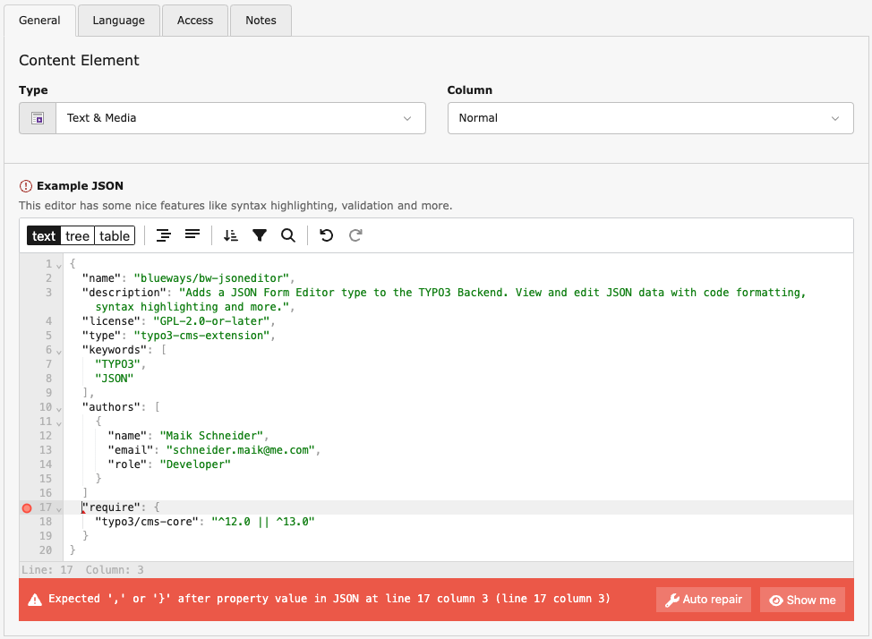

JSON Form Editor
================

Integrates the `JSON Editor <https://github.com/josdejong/jsoneditor>`__ into the TYPO3 Backend.

The extension adds a new `renderType <https://docs.typo3.org/m/typo3/reference-tca/master/en-us/ColumnsConfig/Type/Text/Index.html>`__ "jsonForm" for TCA text columns.

Installation
------------

.. rst-class:: bignums-tip

1. Install via composer

   .. code:: bash

      composer require blueways/bw-jsoneditor

2. Done

   That's it, no configuration needed. Just make sure the extension is enabled and start adjusting your TCA.

Usage
-----

You can set or override any TCA column:

.. code:: php

   $GLOBALS['TCA']['tt_content']['columns']['bodytext']['config']['renderType'] = 'jsonForm';

Configuration
-------------

You can configure the JSON Editor with the `offical API <https://github.com/josdejong/jsoneditor/blob/master/docs/api.md>`__ by adding the settings to the options array:

.. code:: php

   $GLOBALS['TCA']['tt_content']['columns']['bodytext']['config']['options'] = [
      'mode' => 'tree'
   ];

.. note::

   The new option "height" controls the height of the editor when initialized.

Help & Contribution
-------------------

This extension was made by Maik Schneider. Use the `issue tracker <https://github.com/maikschneider/bw_jsoneditor/issues>`__ for bugs and feature requests. If you have any questions, you can `hit me up <https://slack.com/app_redirect?channel=C02KWTE8JRE>`__ at the TYPO3 Slack.

Feel free to contribute!

* `Github-Repository <https://github.com/maikschneider/bw_jsoneditor/>`__

Thanks to `blueways <https://www.blueways.de/>`__ and `XIMA <https://www.xima.de/>`__!
