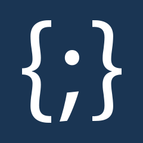

<div align="center">



# TYPO3 extension `bw_jsoneditor`


[](https://extensions.typo3.org/extension/bw_jsoneditor)

[](https://packagist.org/packages/blueways/bw-jsoneditor)

</div>

Integrates the [svelte-jsoneditor](https://github.com/josdejong/jsoneditor) into the TYPO3 Backend.


## Installation

### Composer

```bash
composer require blueways/bw-jsoneditor
```

### TER

[](https://extensions.typo3.org/extension/bw_jsoneditor)

Download the zip file from [TYPO3 extension repository (TER)](https://extensions.typo3.org/extension/bw_jsoneditor).

## Usage

The extension adds a new [custom input](https://docs.typo3.org/m/typo3/reference-tca/main/en-us/ColumnsConfig/Type/User/Index.html) with
renderType `jsonEditor`. You can use the new type in TCA or Content Blocks.

### TCA

When adding a new field to your TCA, use the type `user` and the renderType `jsonEditor`:

```php
ExtensionManagementUtility::addTCAcolumns('my_table', [
    'new_field' => [
        'label' => 'My JSON Field',
        'config' => [
            'type' => 'user',
            'renderType' => 'jsonEditor',
        ],
    ],
]);
```

Make sure the database column of your field is large enough:

```sql
-- ext_tables.sql

CREATE TABLE my_table (
    new_field text
);
```

### Content Blocks

You can use the new renderType in Content Blocks by adding the following configuration:

```yaml
fields:
    -   identifier: new_field
        label: 'My JSON Field'
        type: Textarea
        renderType: jsonEditor
```

## Configuration

You can configure the JSON Editor with the [offical API](https://github.com/josdejong/svelte-jsoneditor?tab=readme-ov-file#api) by adding the
settings to the options array:

```php
$GLOBALS['TCA']['my_table']['columns']['my_field']['config']['options'] = [
    'mode' => 'tree'
];
```

The new option `height` controls the maximum height of the editor, it defaults to `auto`. Setting a value in pixels will
set a fixed height to the editor.

## License

This project is licensed under [GNU General Public License 2.0 (or later)](LICENSE.md).
